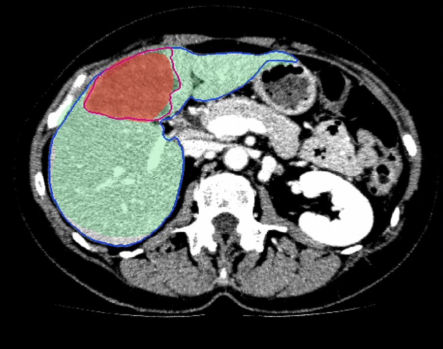
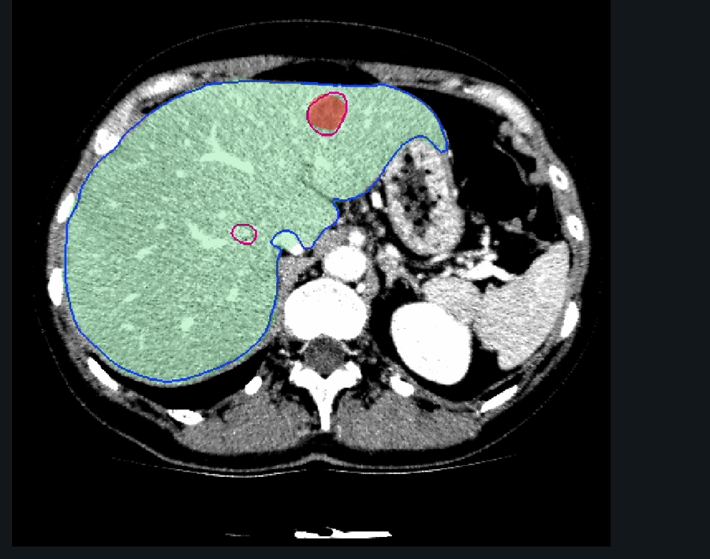
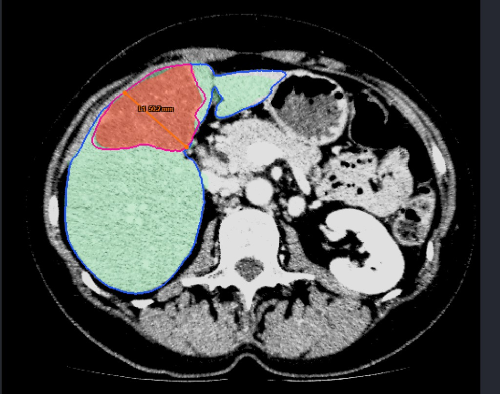
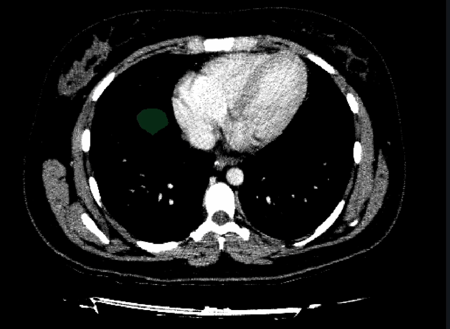

# Raport z projektu — System CAD do objętościowej oceny wątroby i zmian ogniskowych w CT

**Zespół:** Mikita Salauyou, Alina Yermakova
**Temat:** Prototyp systemu CAD (Computer-Aided Diagnosis) do segmentacji i objętościowej oceny wątroby oraz zmian ogniskowych (guzów) w badaniach CT.
**Środowisko:** MATLAB R2025b (Image Processing Toolbox), aplikacja desktopowa.
**Dane testowe:** zbiór IRCAD `3Dircadb1` (serie CT jamy brzusznej z maskami referencyjnymi wątroby i zmian).

---

## 1. Cel projektu (zgodnie z koncepcją)

W koncepcji założyliśmy, że system ma umożliwiać:

- półautomatyczną segmentację wątroby oraz guzów/ognisk w jej obrębie,
- obliczanie objętości wątroby i zmian, a także udziału procentowego zajętej tkanki,
- wizualizację wyników w prostym interfejsie (przeglądarka przekrojów CT z nakładanymi maskami i panelem wyników).

Projekt mieści się w kategorii narzędzi CAD dla obrazowania jamy brzusznej. Chcieliśmy pokazać, w jaki sposób analiza ilościowa może wspierać ocenę badania.

## 2. Co udało się zrealizować

Aplikacja realizuje pełny przepływ pracy: wczytanie CT → segmentacja → wyniki liczbowe → podgląd przekrojów z maskami.

| Obszar | Funkcja | Status |
|---|---|---|
| Wczytywanie danych | DICOM — serie CT (`kwod.loadDicomStudy`) | działa |
| Przeglądarka | nawigacja po przekrojach (suwak, ±1/±10, skróty klawiszowe), preset okna wątrobowego (WL 60 / WW 180) | działa |
| Segmentacja wątroby | ręczny kontur (`drawfreehand`) + dopracowanie aktywnym konturem (`activecontour`, model Chan–Vese) | działa |
| Segmentacja guzów | ręczny kontur + aktywny kontur (model krawędziowy) | działa |
| Rekonstrukcja 3D | interpolacja masek między klatkami kluczowymi (SDF z wyrównaniem środków ciężkości, `kwod.interpolateKeyframes`) | działa, z drobnym zastrzeżeniem |
| Objętości i % | objętość wątroby i zmian [cm³] oraz % zajęcia wątroby (`kwod.computeVolumes`) | działa |
| Ocena jakości | współczynnik Dice względem masek referencyjnych IRCAD (`kwod.dice`, `kwod.loadReferenceMasks`) | działa (poza zakresem koncepcji) |
| Pomiary | linijka [mm] (`kwod.measureLine`), ROI kołowe — pole, średnica, statystyki HU (`kwod.measureCircle`) | działa (poza zakresem koncepcji) |
| Panel wyników | tekstowy panel metryk aktualizowany na bieżąco | działa |

## 3. Wypróbowane metody segmentacji i napotkane problemy

W trakcie prac sprawdziliśmy kilka podejść. Poniżej opisujemy, co próbowaliśmy i dlaczego ostatecznie wybraliśmy taki, a nie inny sposób.

### 3.1. Segmentacja półautomatyczna — rozrost obszaru (region growing) z ziarnem

Pierwszym pomysłem, zgodnym z koncepcją, było klikanie „ziarna” wewnątrz wątroby/guza i rozrastanie obszaru według podobieństwa jasności (HU). W praktyce wątroba w CT ma jasność bardzo zbliżoną do sąsiednich struktur — serca, nerek, śledziony, naczyń i mięśni. Z tego powodu obszar regularnie „przeciekał” poza wątrobę, a wynik mocno zależał od progu i miejsca kliknięcia. Metoda okazała się niestabilna i trudna do powtórzenia, więc zrezygnowaliśmy z niej jako z rozwiązania głównego.

### 3.2. Aktywny kontur (active contour / „snake”, Chan–Vese)

Następnie spróbowaliśmy automatycznie „dociągać” kontur do krawędzi narządu. Uruchomiony w pełni automatycznie kontur albo uciekał na sąsiednie struktury, albo zapadał się do zera, gdy granica wątroby była słabo widoczna. Ostatecznie zostawiliśmy aktywny kontur, ale tylko jako krok dopracowujący obrys narysowany wcześniej ręcznie (z ograniczeniem do wąskiej strefy wokół rysunku użytkownika). W tej roli działa stabilnie i poprawia jakość konturu.

### 3.3. Segmentacja ręczna (podejście główne)

Użytkownik obrysowuje narząd lub zmianę myszą (`drawfreehand`); maska 2D zostaje zapisana na danym przekroju, a sam przekrój staje się „klatką kluczową”. Podejście jest w pełni przewidywalne i daje poprawne maski nawet przy słabym kontraście — jego wadą jest pracochłonność (obrys przekrój po przekroju).

### 3.4. Rekonstrukcja 3D z kilku klatek — interpolacja SDF i artefakt „pływającej maski”

Aby ograniczyć pracochłonność, dodaliśmy interpolację: użytkownik rysuje kontur tylko na kilku przekrojach, a brakujące przekroje są uzupełniane interpolacją transformaty odległości ze znakiem (SDF) z wyrównaniem środków ciężkości. Dla dużych struktur (wątroba) działa to dobrze, natomiast dla małych zmian i na krańcach zakresu maska potrafi „pływać” — pojawia się jako oderwany płat w miejscu, gdzie nie ma już narządu (np. w polu płucnym powyżej kopuły wątroby).

Aby ograniczyć ten efekt, wprowadziliśmy zabezpieczenia: próg dryftu środka ciężkości (zbyt nagły skok między klatkami przerywa łączenie i jest traktowany jako inna zmiana), limit przerwy między klatkami, regułę przerywającą łączenie, gdy między dwiema klatkami guza narysowano wątrobę bez guza (zapobiega to „widmowym” guzom), oraz wyłączenie ekstrapolacji poza zakres narysowanych klatek. Artefakt został przez to wyraźnie ograniczony, ale nie zniknął całkowicie — pozostaje znanym problemem do dalszej pracy.

## 4. Wirtualna resekcja — czego próbowaliśmy i dlaczego zrezygnowaliśmy

Poza zakresem koncepcji podjęliśmy próbę dodania wirtualnej resekcji wątroby, czyli symulacji „odcięcia” fragmentu narządu i oceny pozostawionej objętości (tzw. FLR, *Future Liver Remnant*). Sprawdziliśmy dwa warianty.

Pierwszy to **cięcie płaszczyzną** — użytkownik rysował linię, która dzieliła maskę wątroby na część „usuwaną” i „pozostawianą”. Problem w tym, że płaska, pionowa płaszczyzna nie odpowiada rzeczywistej anatomii wątroby — segmenty Couinauda wyznacza przebieg naczyń, a nie prosta płaszczyzna. Takie „cięcie na surowo” było więc zbyt uproszczone.

Drugi wariant to **resekcja objętościowa** — obrys jamy resekcyjnej na kilku przekrojach i interpolacja między nimi. Był bardziej realistyczny, ale istotnie bardziej złożony i obarczony tymi samymi problemami interpolacji co segmentacja guzów.

Ostatecznie zdecydowaliśmy się z resekcji zrezygnować. Nie opanowaliśmy w pełni poprawnych metod — realistyczna resekcja wymaga wcześniejszej segmentacji terytoriów naczyniowych i podziału na segmenty Couinauda, czego nie zdążyliśmy rzetelnie zrozumieć i wdrożyć. Z kolei „grube” cięcie płaszczyzną uznaliśmy za nieetyczne i niecelowe: narzędzie pokazywało wskaźnik bezpieczeństwa (FLR %) sugerujący ocenę „chirurgiczną”, a przedstawianie tak uproszczonego, anatomicznie niepoprawnego wyniku jako wsparcia decyzji mogłoby wprowadzać w błąd. Resekcja nie była też częścią założeń koncepcji, więc postanowiliśmy skupić się na rzetelnym dopracowaniu segmentacji, objętości i metryk.

**Podsumowanie:** funkcję resekcji wypróbowaliśmy, a następnie świadomie usunęliśmy z aplikacji. Ponieważ z niej korzystaliśmy, wycofaliśmy cały powiązany kod — klasę pomocniczą `kwod.applyResectionPlane` oraz wszystkie elementy interfejsu i logiki (przyciski cięcia liniowego i objętościowego, odwracanie strony, czyszczenie, przełącznik podglądu i panel FLR). Po usunięciu aplikacja kompiluje się bez błędów. Temat zostawiamy jako naturalny kierunek dalszego rozwoju — po wcześniejszym wdrożeniu segmentacji naczyń, podziału na segmenty Couinauda i walidacji wyników.

## 5. Demonstracja działania

### 5.1. Segmentacja wątroby i guzów

Wątroba zaznaczona na zielono, zmiana ogniskowa na czerwono (z obrysem). Maski dobrze przylegają do granic narządu.

Przykład z dwiema zmianami w obrębie wątroby.

### 5.2. Pomiar — linijka

Linijka pozwala zmierzyć odległość w milimetrach bezpośrednio na przekroju CT. Użytkownik zaznacza dwa punkty, a aplikacja przelicza długość na podstawie rozdzielczości badania (spacing) i podpisuje pomiar na obrazie. Na przykładzie zmierzono największy wymiar zmiany ogniskowej — **50,2 mm** (etykieta „L1 50.2 mm”). Pomiar jest przypisany do konkretnego przekroju i pojawia się ponownie po powrocie na ten sam przekrój, dzięki czemu łatwo go odtworzyć i porównać.

### 5.3. Artefakt „pływającej maski”

Na wysokości kopuły wątroby / pola płucnego widać oderwany, „pływający” płat maski w miejscu, gdzie nie ma już tkanki wątroby. Jest to opisany wcześniej artefakt interpolacji/ekstrapolacji SDF.

Z naszych obserwacji wynika, że segmentacja i pomiary działają poprawnie i czytelnie, a głównym widocznym ograniczeniem pozostaje „pływanie” maski na krańcach zakresu interpolacji — i to właśnie traktujemy jako pierwszy kierunek poprawy.

## 6. Porównanie z koncepcją (zaplanowane vs zrealizowane)

| Założenie z koncepcji | Stan realizacji | Komentarz |
|---|---|---|
| Półautomatyczna segmentacja wątroby | częściowo / zmienione | Czysty rozrost obszaru był niestabilny; finalnie ręczny obrys + aktywny kontur (półautomatyczne dopracowanie). |
| Półautomatyczna segmentacja guzów | częściowo / zmienione | Jak wyżej; dodatkowo interpolacja między klatkami (z artefaktem „pływania”). |
| Objętość wątroby i zmian [cm³] | zrealizowane | `kwod.computeVolumes`. |
| Udział procentowy zajętej tkanki | zrealizowane | % zmian względem wątroby. |
| Wizualizacja: przeglądarka + maski + panel wyników | zrealizowane | Pełny interfejs aplikacji. |
| Ocena jakości (metryki, wnioski) | zrealizowane (poza zakresem) | Współczynnik Dice względem masek referencyjnych IRCAD. |
| Pomiary (linijka, ROI, HU) | zrealizowane (poza zakresem) | Nie było w koncepcji — wartość dodana. |
| Wirtualna resekcja (FLR) | usunięte | Spoza koncepcji; wypróbowane i świadomie wycofane. |

Wszystkie podstawowe cele koncepcji zostały osiągnięte (segmentacja, objętości, %, wizualizacja). Cel „półautomatyczności” zrealizowaliśmy w zmienionej formie — ręczny obrys plus aktywny kontur zamiast rozrostu obszaru — ponieważ metody w pełni automatyczne były na tych danych niestabilne. Dodatkowo wykonaliśmy elementy spoza zakresu (Dice, pomiary). Funkcję wykraczającą poza koncepcję, której nie udało się rzetelnie domknąć (resekcję), usunęliśmy.

## 7. Wnioski i kierunki dalszych prac

Udało nam się zbudować działający prototyp CAD: od wczytania CT, przez segmentację (ręczną z dopracowaniem aktywnym konturem), po objętości, procenty i metryki jakości, wraz z czytelną wizualizacją masek i pomiarów. Wprowadziliśmy też obiektywną ocenę jakości segmentacji (Dice względem danych referencyjnych IRCAD).

Główne trudności to niestabilność automatycznej segmentacji na CT (zbliżone HU sąsiednich narządów), artefakt „pływającej maski” przy interpolacji 3D z nielicznych klatek oraz złożoność i ryzyko merytoryczne wirtualnej resekcji.

W dalszych pracach chcielibyśmy: zastosować stabilniejszą segmentację (np. modele uczenia głębokiego typu U-Net/nnU-Net) zamiast rozrostu obszaru; wyeliminować artefakt „pływania” (lepsze dopasowanie klatek i kontrola spójności w 3D); a do tematu resekcji wrócić dopiero po wdrożeniu segmentacji naczyń i podziału na segmenty Couinauda oraz po walidacji wskaźnika FLR — tak, aby wynik był anatomicznie poprawny i odpowiedzialny.
